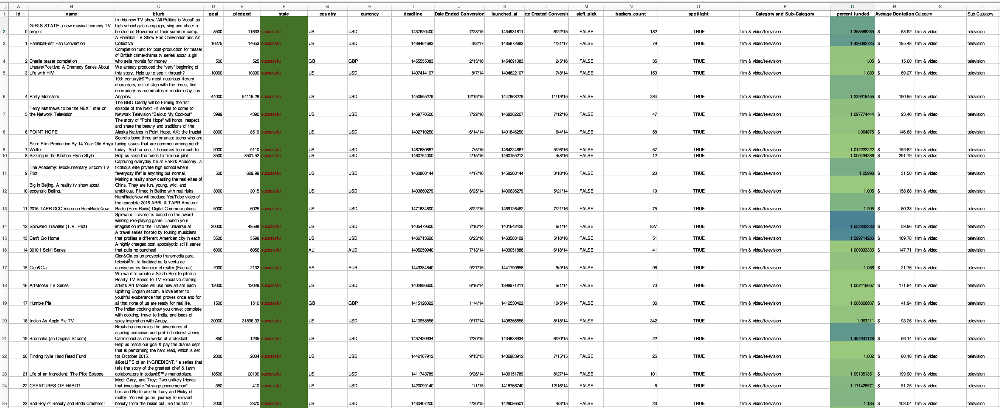
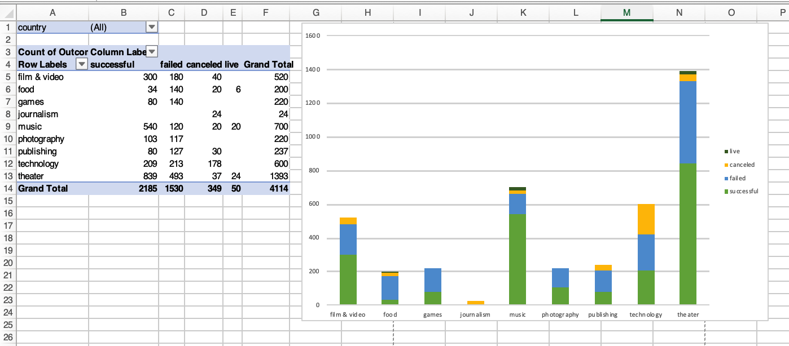
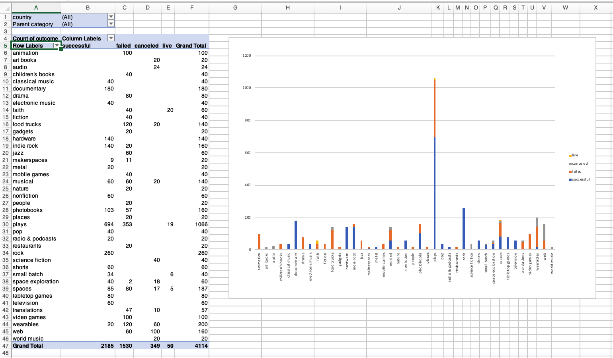

# Looking at Kickstarter Data

This project Uses Excel tables, modifying and analyzing the data of four thousand past Kickstarter projects looking for market trends.

# Skills used in this project 

- Conditional formating
- Piviot Tables
- Formating conversions
- Countifs()
- Chart creations

# Data Set

- Created `percent funded ` and `Average donation` colum.
- Conditonal formating to highlight diferent campaing states.
- Conditonal formating of level of succes achieved.
- Seperated Category and Sub-Category into two seperate columns.
- Converted using unix timestamps into an eaiser to read format.

# Success by Catagory

- Stacked column pivot analyzing by catagories the number of campaigns that were "successful," "failed," "cancelled," or are currently "live" per category
- The table can be filtered by country

# Success by Sub-Catagory

- Stacked column pivot analyzing by catagories the number of campaigns that were "successful," "failed," "cancelled," or are currently "live" per category
- The table can be filtered by country and parent-category

# Outcomes Based on Date created

- Pivot chart line graph that visualizes states by row values of date created
- Table can be filtered by Parent Catagory and Years

# Project Goal Size breakdown

 
 - COUNTIFS() formula used to campaings into groups with different target goals.

 - Line chart that graphs the relationship between goal amount and its chances at success, failure, or cancellation.