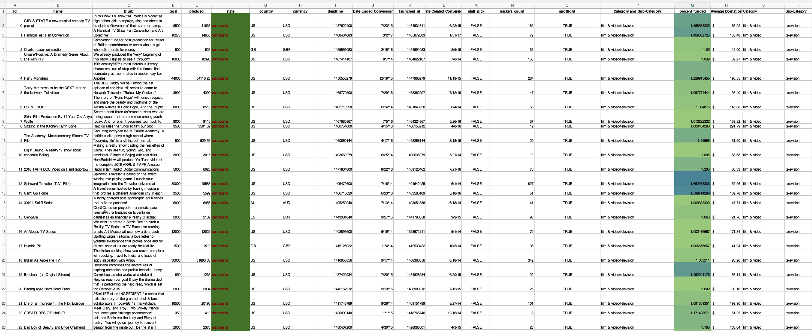
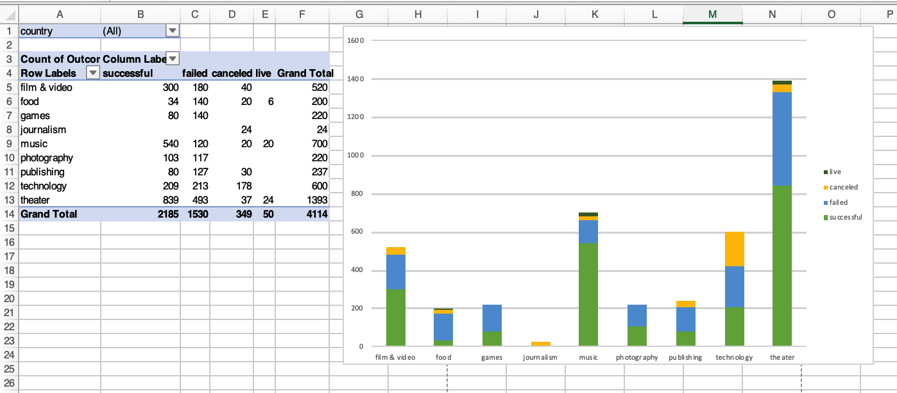
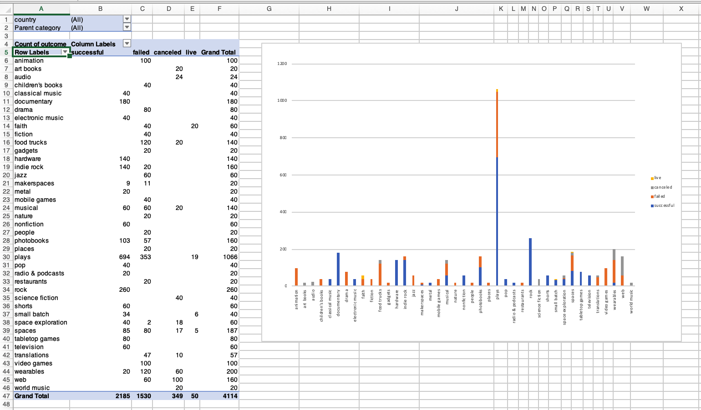
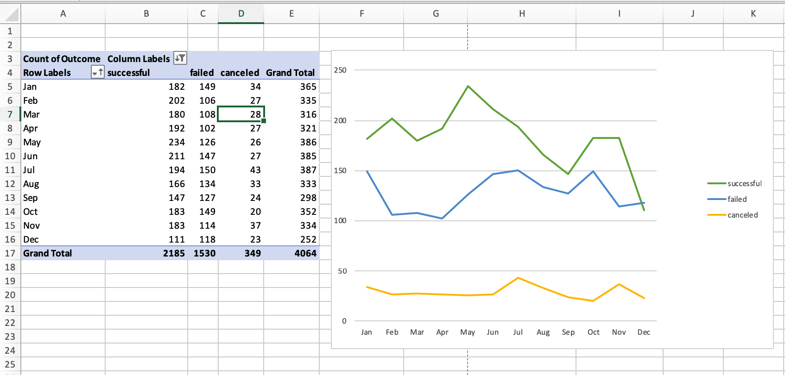
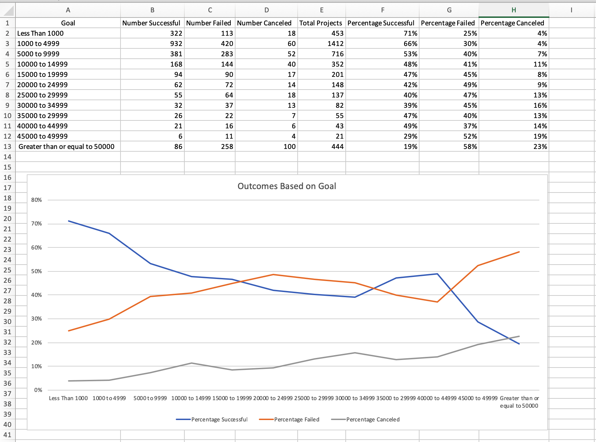

# Analyzing Kickstarter Data

This project uses Excel tables, modifying and analyzing the data of four thousand past Kickstarter projects looking for market trends.

# Skills used in this project 

- Conditional formatting
- Pivot Tables
- Formatting conversions
- COUNTIFS()
- Chart creation

# Data Set

- Created `percent funded ` and `Average donation` column.
- Conditional formatting to highlight different campaign states.
- Conditional formatting of level of success achieved.
- Separated Category and Sub-Category into two separate columns.
- Converted using Unix timestamps into an easier to read format.

# Success by Category

- Stacked column pivot analyzing by categories the number of campaigns that were "successful," "failed," "cancelled," or are currently "live" per category
- The table can be filtered by country

# Success by Sub-Category

- Stacked column pivot analyzing by categories the number of campaigns that were "successful," "failed," "cancelled," or are currently "live" per category
- The table can be filtered by country and parent-category

# Outcomes Based on Date created

- Pivot chart line graph that visualizes states by row values of date created
- Table can be filtered by Parent Category and Years

# Project Goal Size breakdown

 
 - COUNTIFS() formula used to campaigns into groups with different target goals.

 - Line chart that graphs the relationship between goal amount and its chances at success, failure, or cancellation.

